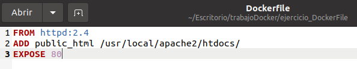
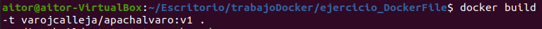
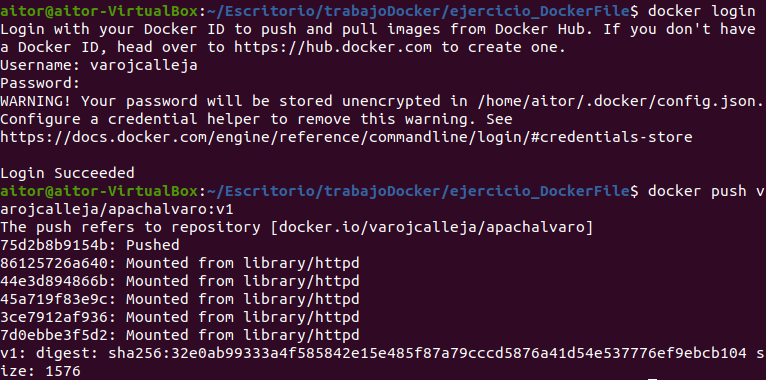
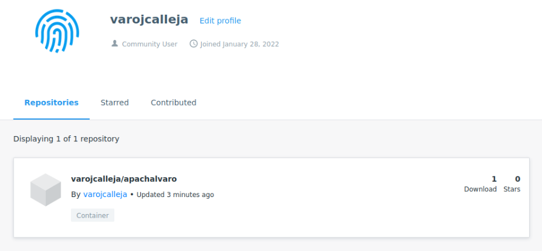
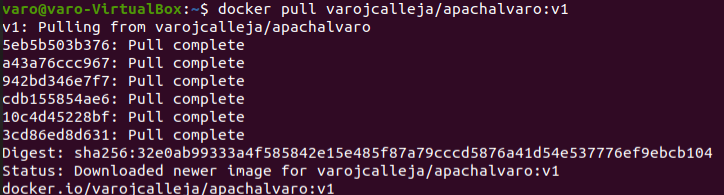
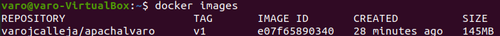
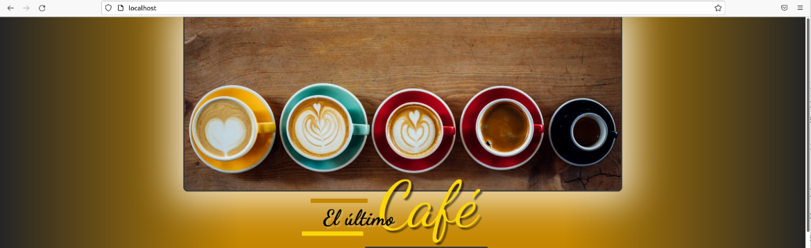

# Ejercicio DockerFile

Mostramos el archivo Dockerfile con las opciones necesarias.




Con este comando creamos la nueva imagen

```bash
docker build -t varojcalleja/apachalvaro:v1 .
```




Subimos la imagen a la cuenta Docker Hub

- Álvaro inicia sesión con su cuenta de Docker Hub 

```bash
docker login varojcalleja
```

- Y sube la imagen creada

```bash
docker push varojcalleja/apachalvaro:v1
```



- Imagen subida a Docker Hub



Aitor se baja la imagen de Docker Hub

```bash
docker pull varojcalleja/apachalvaro:v1
docker images
```






Aitor accede al navegador, se ve la web


