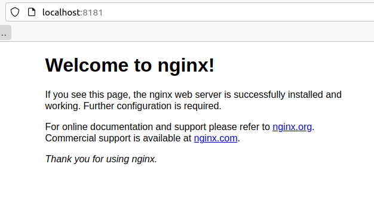

# Ejercicio 1

1.- Pantallazo donde se vea la creación del contenedor y podamos comprobar que el contenedor está funcionando.

Creación del contenedor 

```bash
docker run -d --name servidor_web -p 81:81 nginx
docker ps -a
```

Se puede observar que el contenedor está funcionando


2.- Pantallazo donde se vea el acceso al servidor web utilizando un navegador web.

Se accede desde el navegador por el puerto 8181



3.- Pantallazo donde se vean las imágenes que tienes en tu registro local.

```bash
docker images
```

Se puede observar la imagen de nginx


4.- Pantallazo donde se vea cómo se elimina el contenedor (recuerda que antes debe
estar parado el contenedor).

```bash
docker rm -f servidor_web
```

